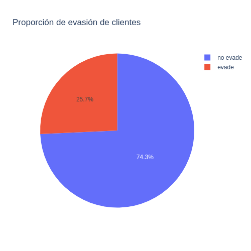
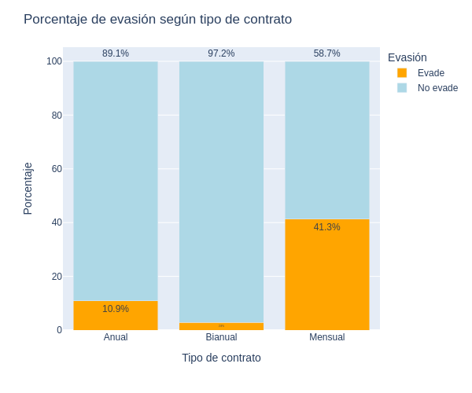

# 🛍️ Proyecto TelecomX

## 📌 Propósito del Proyecto

Este proyecto analiza la evasión de clientes (*churn*) en la empresa de telecomunicaciones TelecomX.
El objetivo es identificar patrones de comportamiento y factores asociados a la pérdida de clientes, mediante visualizaciones estratégicas y una limpieza exhaustiva del dataset.

## 📁 Estructura del Proyecto

```
📦 TelecomX/
 ┣ 📄 grafico_evasion_contrato.png
 ┣ 📄 grafico_evasion_met_pago_contrato.png
 ┣ 📄 grafico_evasion_pie.png
 ┣ 📄 TelecomX_final.ipynb
 ┣ 📄 README.md
 ┗ 📄 requirements.txt

```

## 📊 Ejemplos de Gráficos Generados

A continuación se presentan algunos de los gráficos más relevantes extraídos del análisis:

### 📌 Proporción de evasión


### 📌 Evasión por tipo de contrato


### 📌 Relación entre método de pago, tipo de contrato y evasión


## 📈 Hallazgos Principales

- Los contratos de tipo **mensual** presentan la mayor tasa de evasión en comparación con los de largo plazo.
- Los **pagos manuales** se asocian con una evasión significativamente mayor, mientras que los pagos automáticos ofrecen mayor retención.
- La **antigüedad** y el uso del **servicio de internet** también presentan patrones relevantes en el comportamiento de evasión.
- El tipo de cliente (por ejemplo, nuevos vs. antiguos) influye en la probabilidad de evasión.
- El análisis muestra que el **monto mensual** no es un predictor directo de evasión, pero combinado con otros factores aporta valor.

## ✅ Recomendaciones Finales

- Fomentar la **contratación de planes anuales o de largo plazo**, ofreciendo beneficios exclusivos.
- Promover **métodos de pago automáticos**, como débito o tarjeta, mediante descuentos o promociones.
- Implementar campañas personalizadas de **retención de clientes** en los segmentos más propensos a la evasión.
- Realizar un monitoreo constante de clientes que pagan por internet de alta velocidad (fibra), ya que presentan tasas elevadas de salida.
- Analizar en mayor profundidad las razones específicas de salida para los clientes con menor antigüedad.

## ▶️ Instrucciones para Ejecutar el Notebook

1. Clona este repositorio:
   ```bash
   git clone https://github.com/usuario/proyecto-telecomx.git
   cd proyecto-telecomx
   ```

2. Instala las dependencias:
   ```bash
   pip install -r requirements.txt
   ```

3. Abre el notebook:
   ```bash
   jupyter notebook TelecomX_final.ipynb
   ```

> 💡 Los datos se cargan automáticamente desde una URL pública, por lo que no es necesario descargar archivos adicionales.

## 💡 Herramientas Utilizadas

- Python 3.x
- Pandas, NumPy (procesamiento de datos)
- Plotly, Seaborn, Matplotlib (visualización)
- Kaleido (exportación de imágenes)
- Jupyter Notebook
